# Challenge

**Author**: Hakal  
**Title**: AWS Bucketware  
**Level**: Hard  

---

## Introduction

An attacker used compromised AWS credentials to establish persistence within a cloud environment and propagate large-scale phishing campaigns. In this challenge, as an Incident Responder, you will analyze the various steps taken by the attacker to achieve persistence and set up the staging for phishing campaigns from the compromised environment.

*Inspired by a real-world scenario of actual cloud malware: Ransomware in the Cloud*

---

### Analysis Steps

After following the lab instructions, we need to aggregate all the log files into a single file for easier analysis. To do this, we will use the following command:

```bash
cat *.json > events.json
```

This command concatenates all the JSON log files in the current directory into a single file named `events.json`. This makes it easier to search and analyze the logs using tools like `jq` or any text editor.

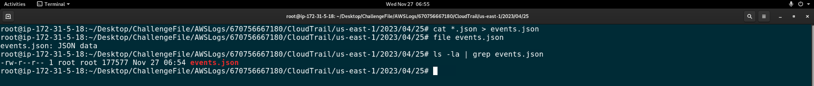

---

### Question 1: What is the compromised identity?

To identify the compromised identity, we executed the following command:

```bash
cat events.json | jq '.Records[] | .userIdentity.userName' -c | sort | uniq -c
```

**Explanation of the Command:**
- `cat events.json`: Reads the content of the `events.json` file.
- `jq '.Records[] | .userIdentity.userName' -c`: Uses jq to parse the JSON and extract the userName field from each record.
- `sort`: Sorts the usernames alphabetically.
- `uniq -c`: Counts the unique occurrences of each username.

**Output:**
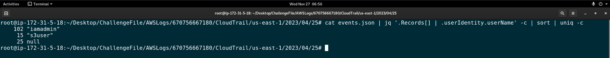

From the output, we can see that the user `s3user` appears 15 times. Given the context of the challenge and the name of the user, we deduce that `s3user` is the compromised identity. This user is likely involved in activities related to S3 buckets, which aligns with the theme of the challenge.

---

### Question 2: In order of occurrence, what were the last three reconnaissance API calls the attacker performed using the compromised credentials?

To identify the last three reconnaissance API calls performed by the attacker using the compromised credentials, we executed the following command:

````bash
cat events.json | jq '.Records[] | select(.userIdentity.userName == "s3user") | .eventName' -c | uniq -c
````

**Explanation of the Command:**

- `cat events.json`: Reads the content of the `events.json` file.
- `jq '.Records[] | select(.userIdentity.userName == "s3user") | .eventName' -c`: Uses jq to parse the JSON, filter records where the `userName` is `s3user`, and extract the `eventName` field.
- `uniq -c`: Counts the unique occurrences of each event name.

**Output:**
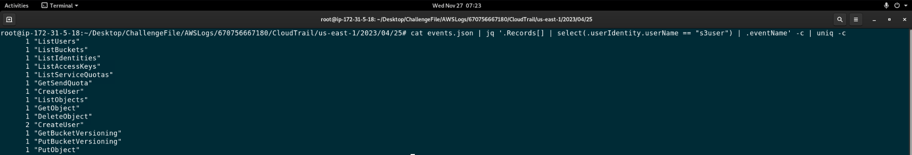

From the output, we can see that the last three reconnaissance API calls were:

1. `GetBucketVersioning`
2. `ListObjects`
3. `GetObject`

---

### Question 3: What was the first successful reconnaissance API call?

To identify the first successful reconnaissance API call, we executed the following command:

````bash
cat events.json | jq '.Records[] | select(.userIdentity.userName == "s3user") | select(.eventName == "ListBuckets")'
````

**Explanation of the Command:**
- `cat events.json`: Reads the content of the events.json file.
- `jq '.Records[] | select(.userIdentity.userName == "s3user") | select(.eventName == "ListBuckets")'`: Uses jq to parse the JSON, filter records where the userName is s3user and the eventName is ListBuckets.

**Output:**
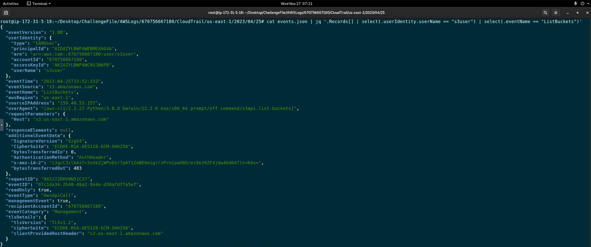

From the output, we can see that the first successful reconnaissance API call was `ListBuckets`. This call is significant because it allows the attacker to enumerate all the S3 buckets in the account, which is a crucial step in identifying potential targets for further exploitation. Unlike the other API calls we observed in Question 2, there were no errors associated with this call, indicating it was successfully executed on the first attempt.

---

### Question 4: How did the attacker attempt to maintain persistence within the environment?

To understand how the attacker attempted to maintain persistence within the environment, we executed the following commands:

````bash
cat events.json | jq '.Records[] | select(.userIdentity.userName == "s3user") | .eventName' -c | uniq -c
````

**Explanation of the Command:**

- `cat events.json`: Reads the content of the `events.json` file.
- `jq '.Records[] | select(.userIdentity.userName == "s3user") | .eventName' -c`: Uses jq to parse the JSON, filter records where the `userName` is `s3user`, and extract the `eventName` field.
- `uniq -c`: Counts the unique occurrences of each event name.

**Output:**


Next, we filtered the events to focus on the `CreateUser` event:

```bash
cat events.json | jq '.Records[] | select(.eventName == "CreateUser")' -c
```

**Explanation of the Command:**
- `cat events.json`: Reads the content of the `events.json` file.
- `jq '.Records[] | select(.eventName == "CreateUser")' -c`: Uses `jq` to parse the JSON and filter records where the `eventName` is `CreateUser`.

**Output:**
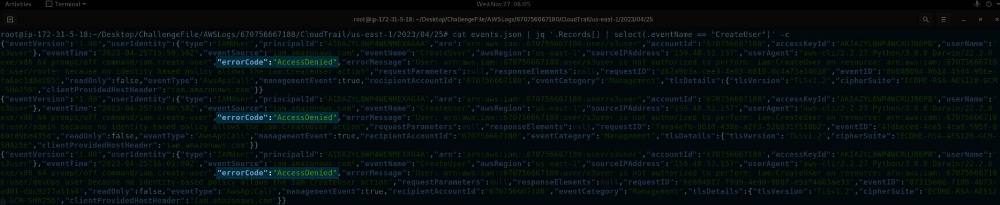

From the output, we can see that the attacker attempted to maintain persistence by creating new IAM users. However, the `errorCode` field indicates `AccessDenied`, meaning the attacker did not have the necessary permissions to successfully create new users. Therefore, the attempt to maintain persistence was not successful.

---

### Question 5: In order of occurrence, which IAM users were involved in this persistence attempt?

To identify which IAM users were involved in the persistence attempt, we executed the following command:

```bash
cat events.json | jq '.Records[] | select(.eventName == "CreateUser") | .errorMessage' -c
```

**Explanation of the Command:**
- `cat events.json`: Reads the content of the `events.json` file.
- `jq '.Records[] | select(.eventName == "CreateUser")' -c`: Uses `jq` to parse the JSON and filter records where the `eventName` is `CreateUser`, and extract the `errorMessage`

**Output:**
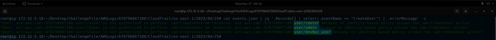

From the output, we are seeing the errorMessage field, which shows the users that the attacker attempted to create. The error messages indicate unauthorized attempts to perform the CreateUser action. These messages reveal that the attacker tried to create the following IAM users, in order: 

1. `rooter`
2. `adm1n`
3. `dev0ps_user`

By analyzing the `errorMessage`, we can identify the specific user creation attempts made by the attacker, even though they were unsuccessful due to insufficient permissions (`AccessDenied`).

---

### Question 6: Were the persistence attempts successful?

`No`, the persistence attempts were not successful. As explained in the previous questions, the attacker tried to create new IAM users to maintain persistence within the environment. However, these attempts failed due to insufficient permissions. The `errorMessage` field in the logs indicated `AccessDenied` errors for each `CreateUser` action.

Basically, the analyzed error messages show that the attacker did not have the necessary permissions to create new users, resulting in unsuccessful persistence attempts.

---

### Question 7: Which S3 bucket was affected in this attack?

To identify the affected S3 bucket, we need to enumerate the resource names associated with the `ListObjects` action performed by the compromised user. We executed the following command:

```bash
cat events.json | jq '.Records[] | select(.userIdentity.userName == "s3user") | select(.eventName == "ListObjects") | .resources[] | .ARN' -c
```

**Explanation of the Command:**
- `cat events.json`: Reads the content of the `events.json` file.
- `jq '.Records[] | select(.userIdentity.userName == "s3user") | select(.eventName == "ListObjects") | .resources[] | .ARN' -c`: Uses `jq` to parse the JSON, filter records where the `userName` is `s3user` and the `eventName` is `ListObjects`, and extract the `ARN` field from the resources array.

**Output:**
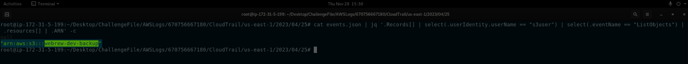

From the output, we can see that the affected S3 bucket in this attack is `webrew-dev-backup`. This bucket was targeted by the attacker using the `ListObjects` action, which is typically used to list the objects within an S3 bucket.

---

### Question 8: How did the attacker check for protection on this resource?

To determine how the attacker checked for protection on the affected S3 bucket, we need to look at the `GetBucketVersioning` actions performed by the compromised user. We executed the following commands:

```bash
cat events.json | jq '.Records[] | select(.userIdentity.userName == "s3user") | select(.eventName == "GetBucketVersioning") | .resources[] | .ARN' -c
```

**Explanation of the Command:**
- `cat events.json`: Reads the content of the `events.json` file.
- `jq '.Records[] | select(.userIdentity.userName == "s3user") | select(.eventName == "GetBucketVersioning") | .resources[] | .ARN' -c`: Uses `jq` to parse the JSON, filter records where the `userName` is `s3user` and the `eventName` is `GetBucketVersioning`, and extract the `ARN` field from the resources array.

**Output:**
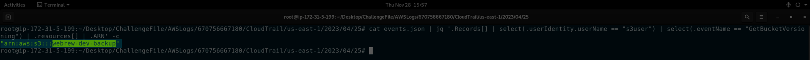

From the output, we can see that the attacker checked for protection on the `webrew-dev-backup` bucket by attempting to get the bucket versioning configuration. The `GetBucketVersioning` action is used to retrieve the versioning state of an S3 bucket, which can help the attacker determine if versioning is enabled and if any protection mechanisms are in place.

---

### Question 9: How did the attacker remove the protection on this resource?

To determine how the attacker removed the protection on the affected S3 bucket, we need to look at the `PutBucketVersioning`actions performed by the compromised user. We executed the following command:

```bash
cat events.json | jq '.Records[] | select(.userIdentity.userName == "s3user") | select(.eventName == "PutBucketVersioning")' -c
```

**Explanation of the Command:**
- `cat events.json`: Reads the content of the `events.json` file.
- `jq '.Records[] | select(.userIdentity.userName == "s3user") | select(.eventName == "PutBucketVersioning")' -c`: Uses `jq` to parse the JSON, filter records where the `userName` is `s3user` and the `eventName` is `PutBucketVersioning`.

**Output:**
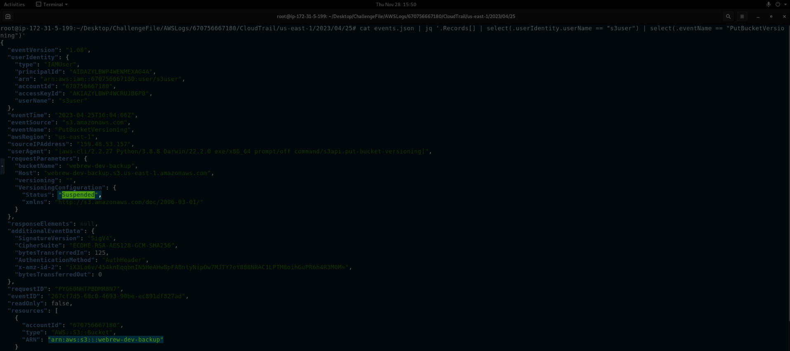

From the output, we can see that the attacker removed the protection on the `webrew-dev-backup` bucket by changing the bucket versioning configuration. The `PutBucketVersioning` action was used to suspend the versioning state of the S3 bucket, which effectively removed the protection mechanisms that were in place.

---

### Question 10: What file did the attacker exfiltrate?

```bash
cat events.json | jq '.Records[] | select(.userIdentity.userName == "s3user") | select(.eventName == "GetObject") | .resources[] | .ARN' -c
```

**Explanation of the Command:**
- `cat events.json`: Reads the content of the `events.json` file.
- `jq '.Records[] | select(.userIdentity.userName == "s3user") | select(.eventName == "GetObject") | .resources[] | .ARN' -c`: Uses `jq` to parse the JSON, filter records where the `userName` is `s3user` and the `eventName` is `GetObject`, and extract the `ARN` field from the resources array.

**Output:**
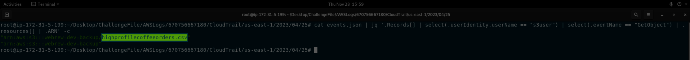

From the output, we can see that the attacker exfiltrated the file `highprofilecoffeeorders.csv` from the `webrew-dev-backup` bucket. This file was accessed using the `GetObject` action, indicating that it was retrieved by the attacker.

---

### Question 11: What was the name of the ransom note?

To identify the name of the ransom note, we need to look at the `PutObject` actions performed by the compromised user. We executed the following command:

**Explanation of the Command:**
- `cat events.json`: Reads the content of the `events.json` file.
- `jq '.Records[] | select(.userIdentity.userName == "s3user") | select(.eventName == "PutObject") | .resources[] | .ARN' -c`: Uses `jq` to parse the JSON, filter records where the `userName` is `s3user` and the `eventName` is `PutObject`, and extract the `ARN` field from the resources array.

**Output:**
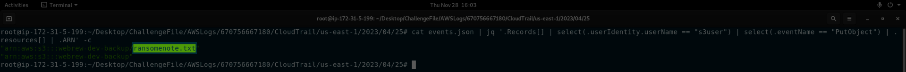

From the output, we can see that the name of the ransom note is `ransomenote.txt`. This file was uploaded to the `webrew-dev-backup` bucket using the `PutObject` action, indicating that it was placed there by the attacker.

---

## Conclusion

### Incident Summary:

In this challenge, we analyzed a security incident involving compromised AWS credentials used to establish persistence within a cloud environment and propagate large-scale phishing campaigns. The attacker leveraged the compromised credentials to perform various actions, including reconnaissance, persistence attempts, and exfiltration of sensitive data.

The compromised identity was identified as the IAM user `s3user`, which appeared 15 times in the logs. This user was actively used by the attacker to perform various actions within the AWS environment. The attacker performed several reconnaissance API calls using the compromised credentials. The last three reconnaissance API calls were `GetBucketVersioning`, `ListObjects`, and `GetObject`. The first successful reconnaissance API call was `ListBuckets`, which allowed the attacker to enumerate all the S3 buckets in the account.

The attacker attempted to maintain persistence within the environment by creating new IAM users. However, these attempts were unsuccessful due to insufficient permissions. The `errorMessage` field in the logs indicated `AccessDenied` errors for each `CreateUser` action. The specific user creation attempts were `rooter`, `adm1n`, and `dev0ps_user`.

The affected S3 bucket in this attack was identified as `webrew-dev-backup`. This bucket was targeted by the attacker using the `ListObjects` action to list the objects within the bucket. The attacker checked for protection on the `webrew-dev-backup` bucket by attempting to get the bucket versioning configuration using the `GetBucketVersioning` action. This action is used to retrieve the versioning state of an S3 bucket, which can help the attacker determine if versioning is enabled and if any protection mechanisms are in place.

The attacker removed the protection on the `webrew-dev-backup` bucket by changing the bucket versioning configuration. The `PutBucketVersioning` action was used to suspend the versioning state of the S3 bucket, effectively removing the protection mechanisms that were in place. The attacker exfiltrated the file `highprofilecoffeeorders.csv` from the `webrew-dev-backup` bucket. This file was accessed using the `GetObject` action, indicating that it was retrieved by the attacker. The name of the ransom note was identified as `ransomenote.txt`. This file was uploaded to the `webrew-dev-backup` bucket using the `PutObject` action, indicating that it was placed there by the attacker.

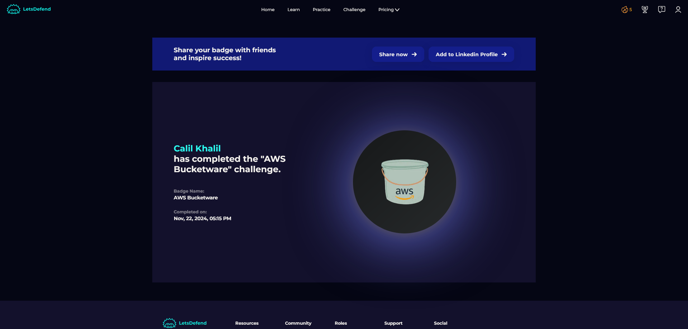

### Key Takeaways:

- **Monitor and Secure IAM Credentials**: Regularly monitor IAM credentials for any suspicious activity and ensure they are securely managed.
- **Implement Strict Access Controls**: Apply the principle of least privilege to limit access to only what is necessary for users to perform their tasks.
- **Regularly Review Audit Logs**: Continuously review audit logs to detect and respond to unauthorized activities promptly.
- **Enable Multi-Factor Authentication (MFA)**: Enforce MFA for all users to add an extra layer of security.
- **Use AWS Config and CloudTrail**: Utilize AWS Config and CloudTrail to monitor and log all activities within your AWS environment.
- **Regular Security Audits**: Conduct regular security audits and assessments to identify and mitigate potential vulnerabilities.
- **Educate and Train Employees**: Provide regular training to employees on security best practices and how to recognize phishing attempts.

This incident highlights the importance of monitoring and securing IAM credentials, implementing strict access controls, and regularly reviewing audit logs to detect and respond to unauthorized activities promptly.
