# **Challenge**

**Author**: Hakal  
**Title**: Http Basic Auth.  
**Level**: Easy

---

## Introduction

We received a log indicating a possible attack. Can you gather information from the `.pcap` file?

Log file: `/root/Desktop/ChallengeFile/webserver.em0.pcap`

Note: The `.pcap` file was found in public resources.

---

### Analysis Steps

After following the lab instructions, we need to connect to the machine and analyze the `.pcap` files using the provided tool. The idea is to make the process easier.

---

### Question 1: How many HTTP GET requests are in the pcap file?

To identify how many HTTP GET requests are in the `.pcap` file, we don't need to count or filter every HTTP GET request manually. Opening the `.pcap` file with Wireshark will give us a screen like this:

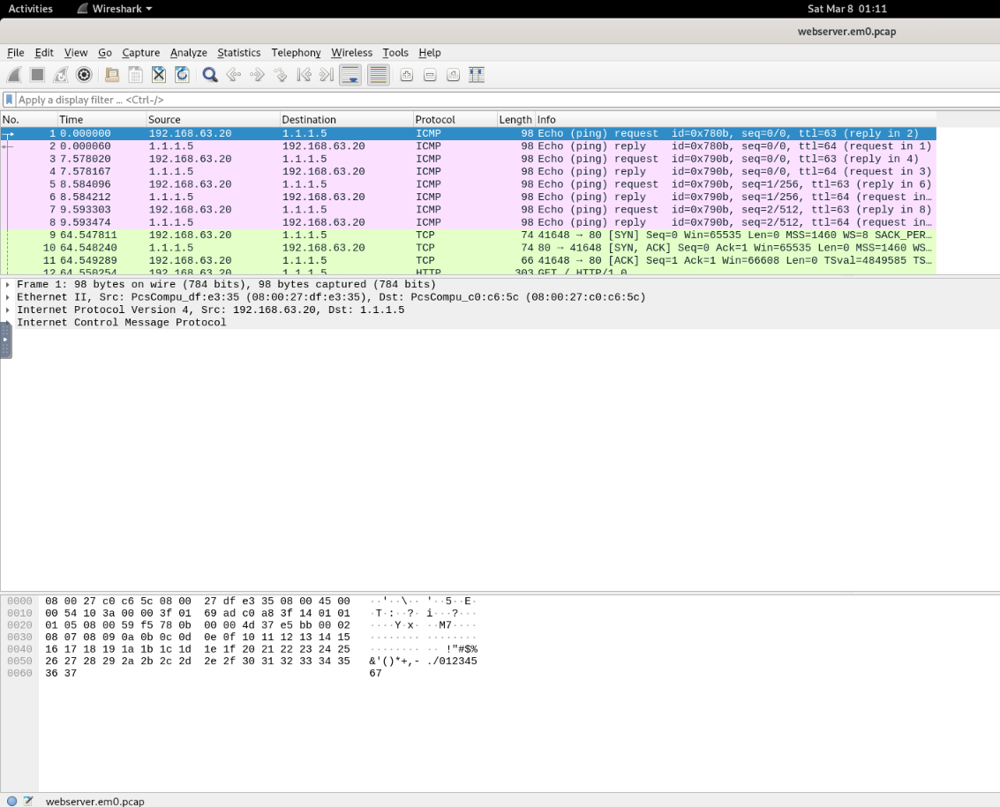

At the top of the Wireshark window, we have the `Statistics` option. This option provides statistics about connections, protocols, and allows us to filter to understand which IP uses a specific type of protocol, which port was most accessed, and other details.

To see the HTTP GET method and how many times it was called, click on `Statistics`, select the protocol we want to see the statistics for, and click on `Packet Counter`.

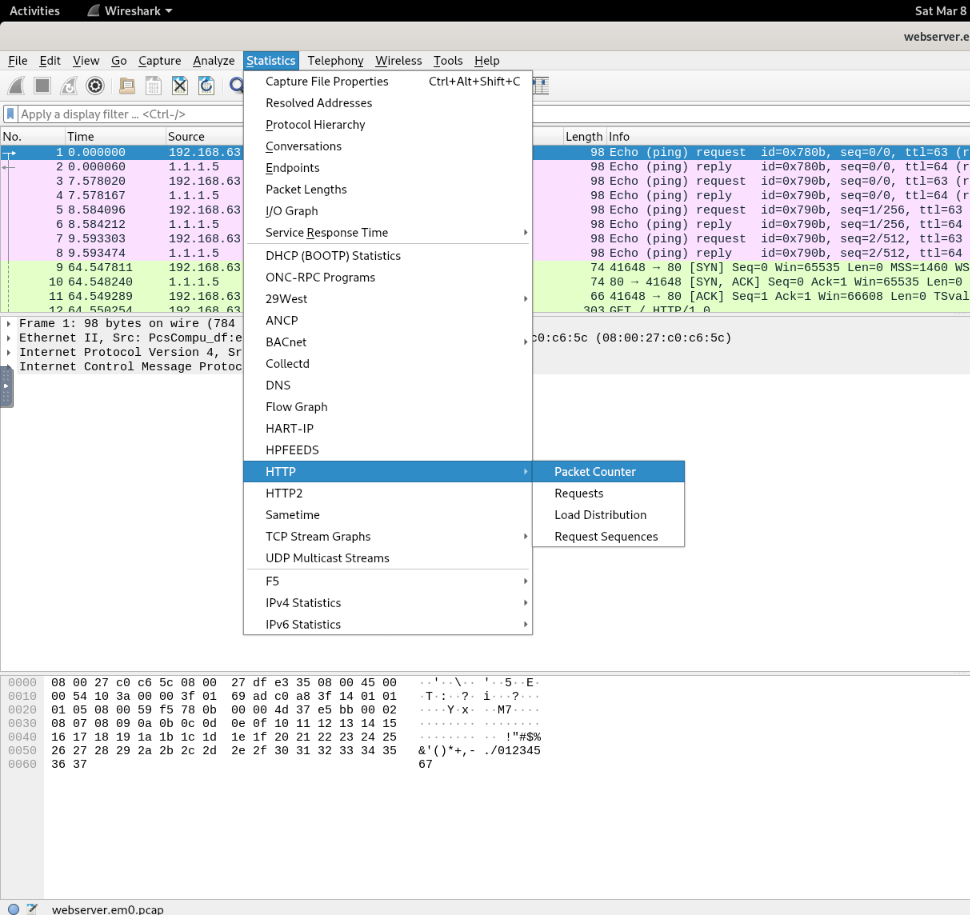

Using this option, we can find the answer to the question as a table will appear showing the methods and their counts.

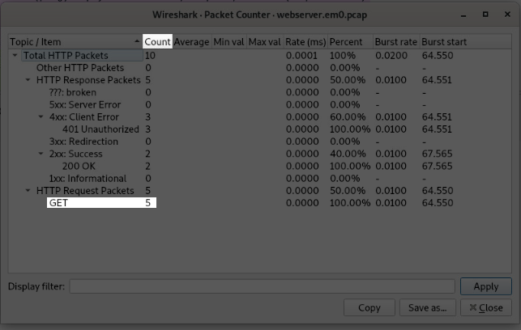

---

### Question 2: What is the server operating system?

On the first screen of Wireshark, we can see some packets with [TTL](https://en.wikipedia.org/wiki/Time_to_live) values that can be used to determine the operating system generically.

[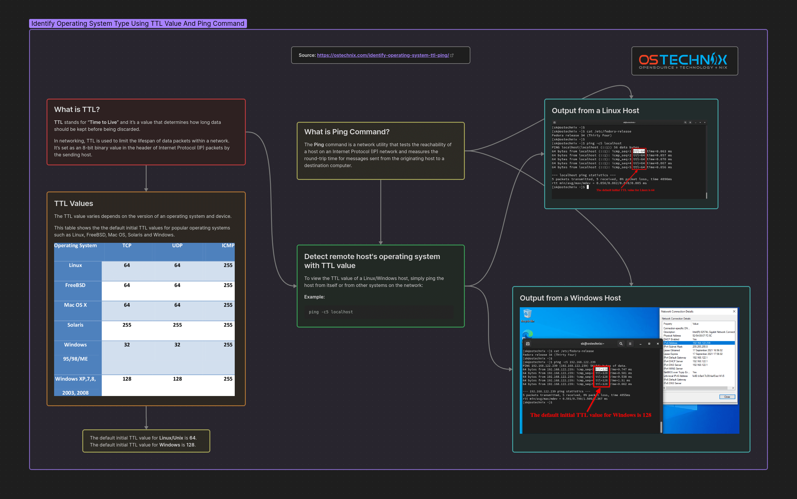](https://ostechnix.com/identify-operating-system-ttl-ping/)

By paying attention to the initial Wireshark screen, we can see that the TTL of both responses when ping is called and responded to is 64, indicating that we are dealing with Linux/Unix systems. However, we still don't know the specific operating system.

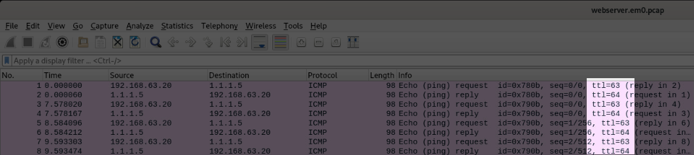

We know we are dealing with Linux/Unix servers and a web application. To determine the specific operating system and the server behind the application, we need to navigate through the packets with the `HTTP` protocol.

On the initial Wireshark screen, as shown earlier, we can immediately see calls in green, the default color used by Wireshark for HTTP packets. The Protocol and Info columns explicitly contain HTTP.

To analyze a specific TCP stream, right-click on the first HTTP packet visible on the main screen and select `Follow TCP Stream`.

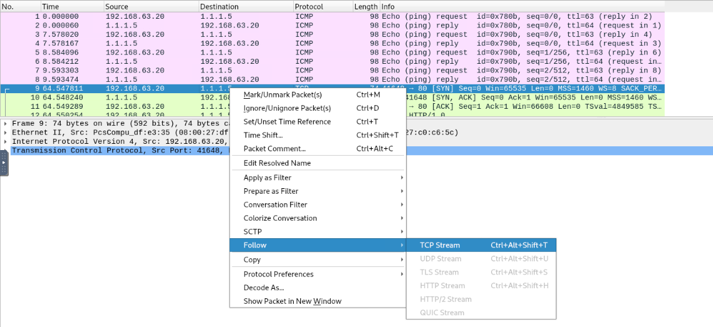

Clicking this option will open a window with information in [ASCII](https://en.wikipedia.org/wiki/ASCII), showing us the headers of the communication and relevant information such as the operating system and other standard headers in HTTP communications.

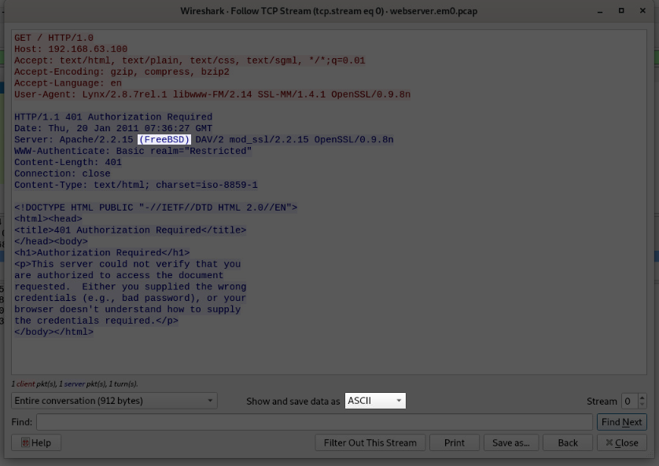

As we can see, the operating system name is revealed. This happens because many servers (like Apache, Nginx, or IIS) automatically include headers like `Server` or `X-Powered-By` in HTTP responses. These headers reveal details about the underlying infrastructure, which is considered a security bad practice as it exposes information that can lead to targeted attacks on specific software vulnerabilities. Therefore, avoid doing this.

---

### Question 3: What is the name and version of the web server software?

In the TCP Stream, we can see the response header indicating the server, version, and operating system as we did earlier.

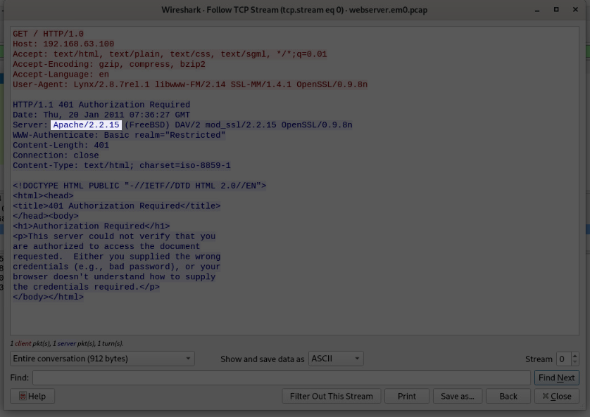

---

### Question 4: What is the version of OpenSSL running on the server?

The same process applies to finding the OpenSSL version.

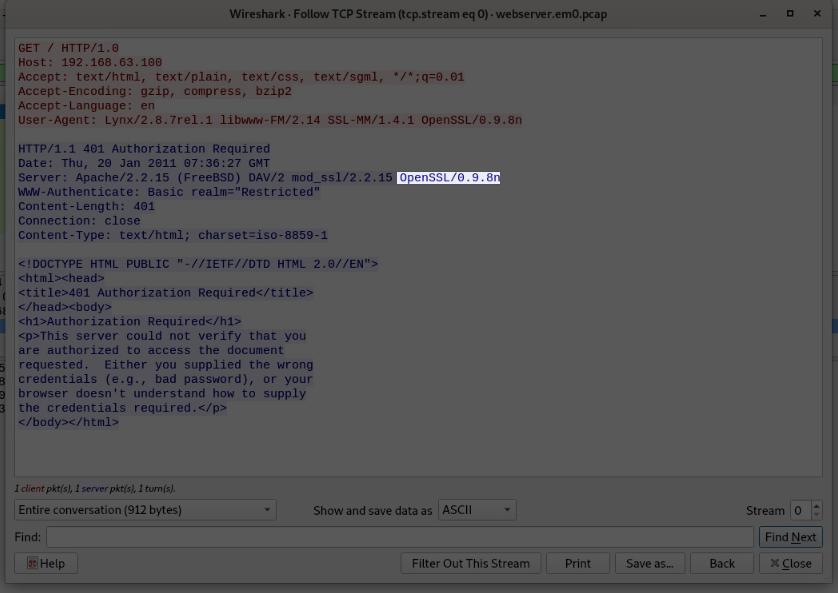

---

### Question 5: What is the client's user-agent information?

The user-agent is passed client-side to inform the server about the client's technical characteristics (browser, operating system, device) to allow content adaptation.

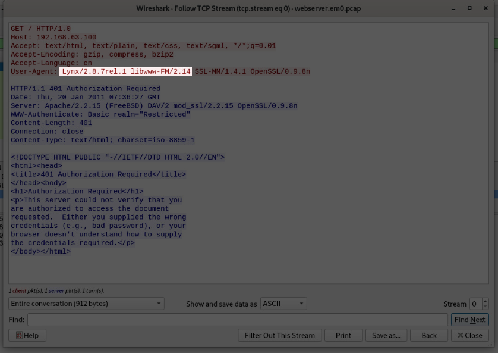

For this reason, we see it first in Wireshark, as it is the client's request, not the server's response.

---

### Question 6: What is the username used for Basic Authentication?

Knowing that we are dealing with Basic Authentication, we can use a simple Wireshark filter. But first, let's explain what Basic Authentication is. HTTP Basic Authentication is a simple access control method that uses a pair of credentials (username and password) encoded in [Base64](https://en.wikipedia.org/wiki/Base64) to protect web resources. Although widely supported and easy to implement, it presents significant security risks when not used with encryption protocols.

In other words, the password is almost passed in plain text, encoded in Base64 and decoded server-side.

To capture this specific packet, use the filter `http.authbasic` in the filter bar at the top of the window. With the filter applied, we will see only two packets, with the first one showing relevant authentication information.

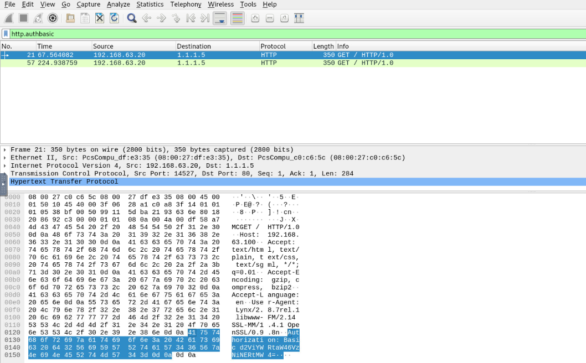

Analyzing this field, we see a Base64 string, which is expected in a communication involving Basic Authentication.

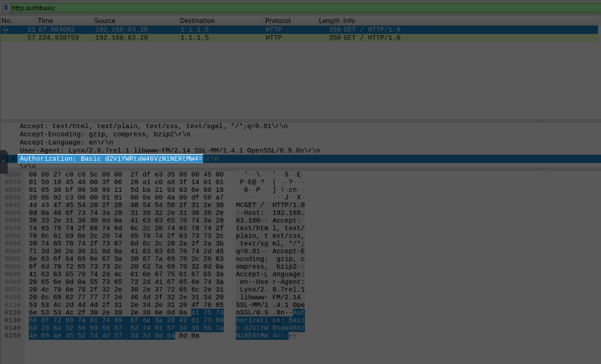

We know it is Base64 because it contains the following characteristics:

- Uppercase letters: A–Z (26 characters)
- Lowercase letters: a–z (26 characters)
- Digits: 0–9 (10 characters)
- Padding character: = (last character)

To answer this question, copy the string and decode it using the terminal. Linux/Unix systems have simple utility binaries for resolving and decoding strings like Base64, hexadecimal, etc.

To decode, open the terminal and execute the following command:

```bash
echo 'd2ViYWRtaW46VzNiNERtMW4=' | base64 -d       
```

**Explanation of the Command:**

- `echo`: Sends the string to the standard output ([stdout](https://en.wikipedia.org/wiki/Standard_streams#Standard_output_(stdout)))
- `'d2ViYWRtaW46VzNiNERtMW4='`: Base64 encoded credentials (username:password) obtained from previous analysis.
- `|`: Redirects the output of echo to the next command.
- `base64 -d`: Decodes the received input (-d = decode)

Executing the command will reveal the username and password used in the application's Basic Authentication.

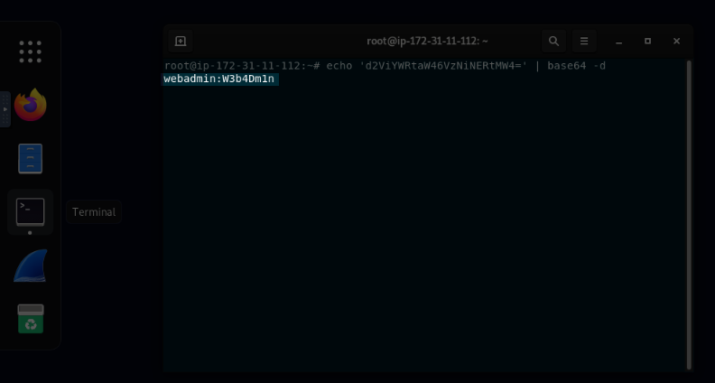

---

### Question 7: What is the user password used for Basic Authentication?

As seen earlier, the password follows the `:` because Base64 encoding in Basic Authentication occurs as the HTTP protocol requires credentials to be transmitted in an ASCII-compatible text format. This encoding serves as a serialization mechanism, **not encryption**. The [RFC 7617](https://www.rfc-editor.org/rfc/rfc7617.html) standard defines that credentials should be combined as `username:password` before encoding. The colon `(:)` separates the fields so the server can extract them after decoding.

---

## Conclusion

By analyzing the `.pcap` file with Wireshark, it is possible to identify HTTP requests, determine operating systems, software versions, and even discover credentials transmitted via Basic Authentication. This highlights the importance of using secure channels (HTTPS) and ensuring that servers do not disclose sensitive information through headers or plain text communication.

### Key Takeaways

- Wireshark’s **Statistics** and **Packet Counter** features ease the discovery of HTTP methods.  
- The **TTL** value can help identify the general operating system family.  
- **HTTP response headers** often reveal server information, including version and OS details.  
- **Base64** in Basic Authentication is not encryption and is insecure without TLS.  
- Always consider the security implications of server headers that disclose sensitive system details.

---
