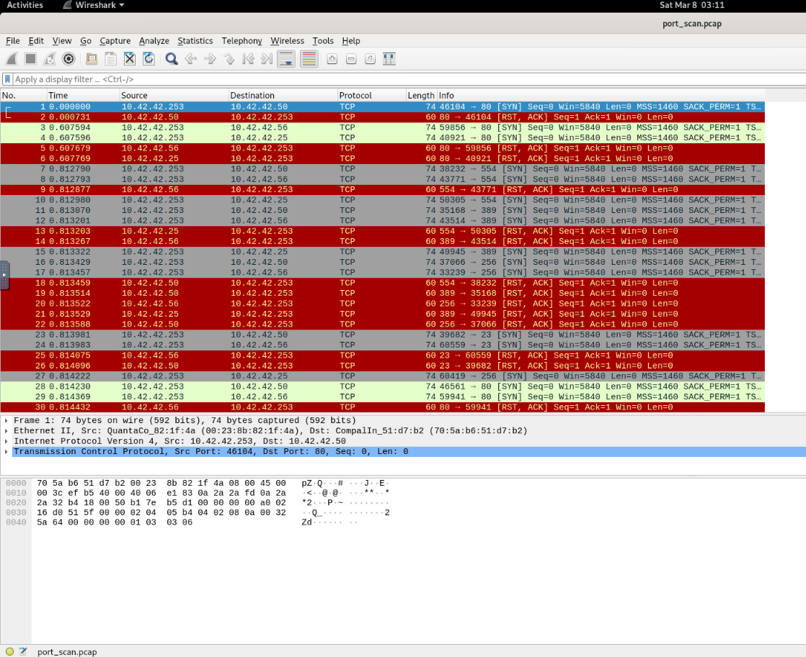
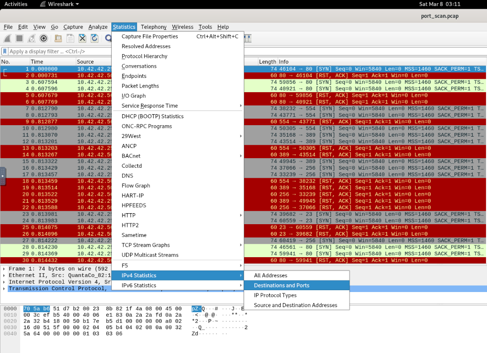
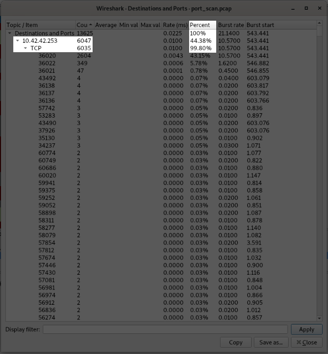
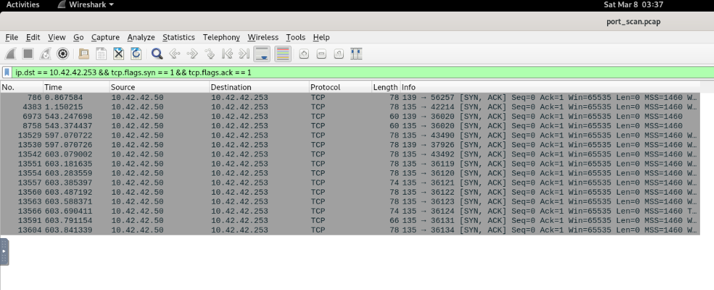
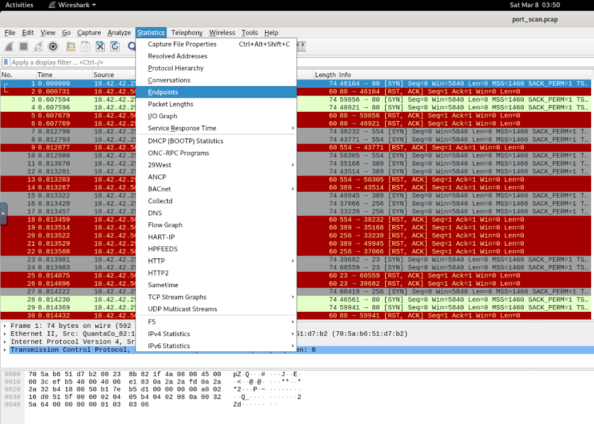
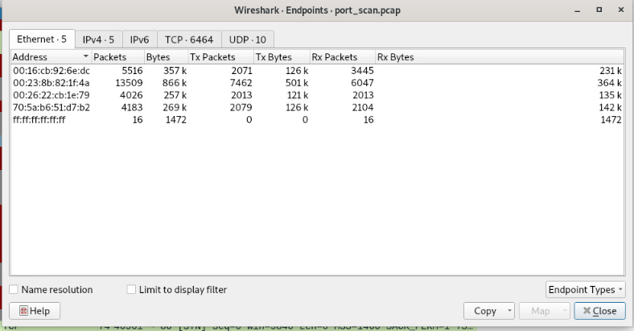
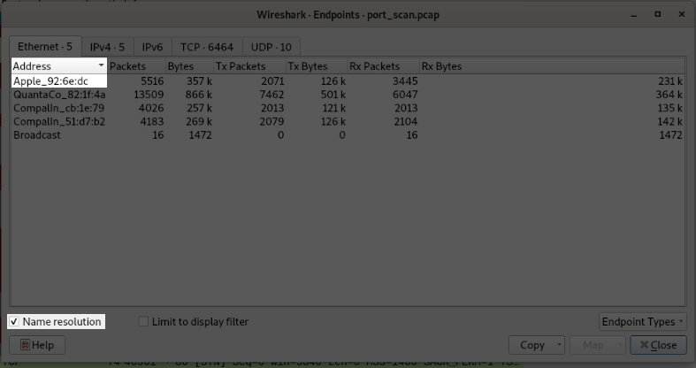
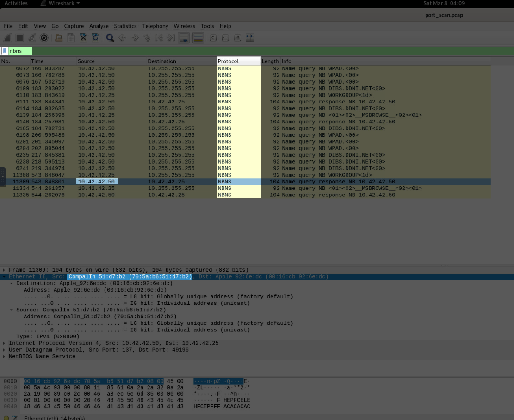

# **Challenge**

**Author**: Hakal  
**Title**: Port Scan Activity
**Level**: Easy

---

## Introduction

Can you determine evidence of port scan activity?

Log file: `/root/Desktop/ChallengeFile/port_scan.pcap`

Note: The `.pcap` file was found in public resources.

---

### Analysis Steps

After following the lab instructions, we need to connect to the machine and analyze the `.pcap` files using the provided tool. The idea is to make the process easier.

---

### Question 1: What is the IP address scanning the environment?

To identify the IP associated with the port scan, it is straightforward. We do not need to count requests by IP and port or filter communications. Opening the `.pcap` file with Wireshark will give us a screen like this:

At the top of the Wireshark window, we have the `Statistics` option. This option provides statistics about connections, protocols, and allows us to filter to understand which IP uses a specific type of protocol, which port was most accessed, and other details.

In our case, we will use the `IPv4 Statistics` option and click on `Destination and Ports`.

Using this option, we can find the answer to the question as a table will appear showing the behavior. In our case, it will not be the first one; we need to click on the `Count` column name to view the IP with the highest count since Wireshark orders by ascending order.

---

### Question 2: What is the IP address found as a result of the scan?

To understand which IP returned results from the scan, we need to have some basic premises:

- Port scans attempt to sweep a list or the entire list of existing ports.
- Considering that our `Destination and Ports` statistics indicate many attempts on the [`TCP`](https://en.wikipedia.org/wiki/Transmission_Control_Protocol) protocol, the port scan would only return the result that the port is open when the [three-way handshake](https://en.wikipedia.org/wiki/Handshake_(computing)#TCP_three-way_handshake) is completed, which is an immutable premise of [computer networks](https://en.wikipedia.org/wiki/Computer_network) and the behavior of many port scan tools.

Knowing this, the best thing to do is to filter where the source, i.e., the client, corresponds to the IP: `10.42.42.253` and the target's response is `SYN, ACK`.

To capture these types of packets, we can use the filter `ip.dst == 10.42.42.253 && tcp.flags.syn == 1 && tcp.flags.ack == 1` in the filter bar at the top of the window. With the filter applied, we will see all the packets where a target responded with `SYN, ACK` to the scanner, confirming that the port is open.

**Explanation of the Filter:**

- `ip.dst == 10.42.42.254`: Focuses exclusively on traffic destined for the server/computer with this private IP address.
- `&&`: Works as an AND operator to apply filter upon filter.
- `tcp.flags.syn == 1`: Identifies packets with the SYN flag active, used to initiate TCP connections.
- `tcp.flags.ack == 1`: Selects packets with the ACK flag active, which confirms the receipt of data.

Given the evidence, we can conclude that the only IP that returned open ports to the attacker was `10.42.42.50`.

---

### Question 3: What is the MAC address of the Apple system it finds?

To answer this question, we will use the `Statistics` option again, but this time we will use the `Endpoints` option, which details information about the machines, such as the time of the first communication, [MAC address](https://en.wikipedia.org/wiki/MAC_address), among others.

Now with this option, we will have a window showing MAC addresses with some columns detailing information such as `Packets`, `Bytes`, among others.

If you notice, Wireshark has an option called `Name resolution` in the bottom left corner, which basically uses the [`ARP`](https://www.fortinet.com/resources/cyberglossary/what-is-arp) protocol to translate and identify the device on the network. By selecting this option, we will be able to know which MAC address belongs to the Apple device.

Now we know that the first device is the Apple device corresponding to the MAC address: `00:16:cb:92:6e:dc`.

---

### Question 4: What is the IP address of the detected Windows system?

Since in our last step we could not easily identify the Windows device like the Apple device, we will use a new approach by filtering a specific protocol called [`NBNS`](https://wiki.wireshark.org/NetBIOS/NBNS), often called WINS on Windows systems.

NetBIOS Session Service packets are sent to the LAN's broadcast address that had the device's NetBIOS name. We can see from below that in the `Ethernet II protocol` that the source was.

Knowing this information, we can filter and look inside the Ethernet II header in the packet looking for suggestive keywords, which in our case is Windows.

Unfortunately, searching all the packets, nothing was suggestive enough to find the Windows device. Thus, I did basic research and found on the internet that our Windows device is the device with the first 3 bytes `(70:5a:b6)` that identify the manufacturer (Compal Electronics, a Taiwanese company that produces hardware for brands like Dell and Lenovo).

To correlate the IP with this information was easy; we knew that the IP `10.42.42.25` is the Apple device and `10.42.42.253` is the attacker's device, leaving us with only two IPs, `10.42.42.25` and `10.42.42.50`, which was correlated with the incident and was the correct answer.

---

## Conclusion

In this challenge, we successfully identified key network elements and activities using Wireshark, a powerful network protocol analyzer. By following systematic analysis steps, we were able to determine the IP addresses involved in port scanning, identify the MAC address of an Apple device, and pinpoint the IP address of a Windows system. These findings demonstrate the importance of understanding network traffic and utilizing appropriate tools to analyze and interpret data effectively.

### Key Takeaways

- By leveraging Wireshark's `Statistics` and `IPv4 Statistics` features, we can quickly identify IP addresses involved in port scanning activities.
- Sorting by the `Count` column helps in pinpointing the IP address with the highest number of connection attempts.
- Using Wireshark's filter capabilities, such as `ip.dst == <IP> && tcp.flags.syn == 1 && tcp.flags.ack == 1`, allows us to isolate packets that indicate successful port scans.
- Understanding TCP flags and their significance in network communication is crucial for accurate filtering.
- The `Endpoints` option in Wireshark's `Statistics` provides detailed information about devices, including MAC addresses.
- Enabling `Name resolution` helps in translating MAC addresses to device names, aiding in device identification.
- Filtering for specific protocols like `NBNS` can help identify different types of systems devices on the network.
- Knowledge of manufacturer-specific MAC address prefixes can assist in correlating IP addresses with device types.

By mastering these techniques, network analysts can efficiently detect and respond to suspicious activities, ensuring the security and integrity of network environments.

---
