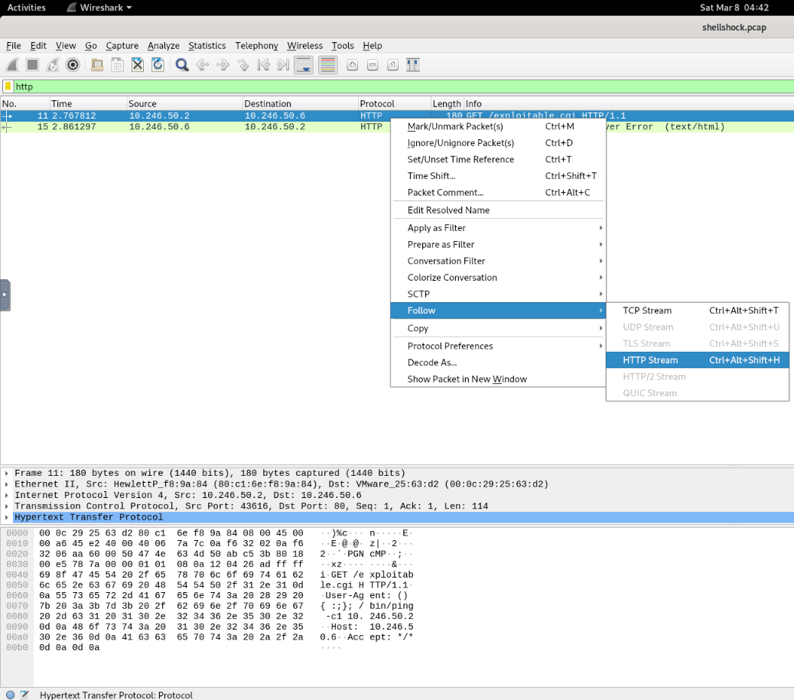
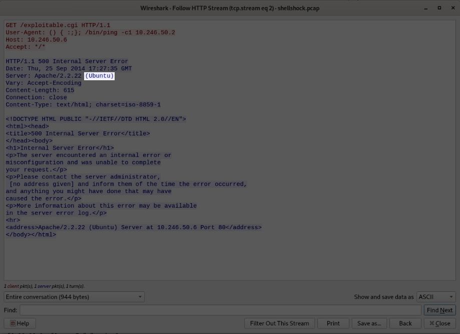
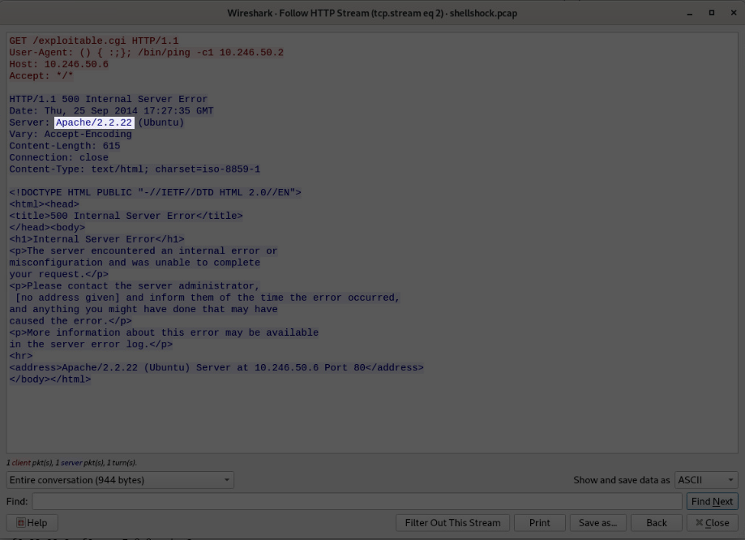
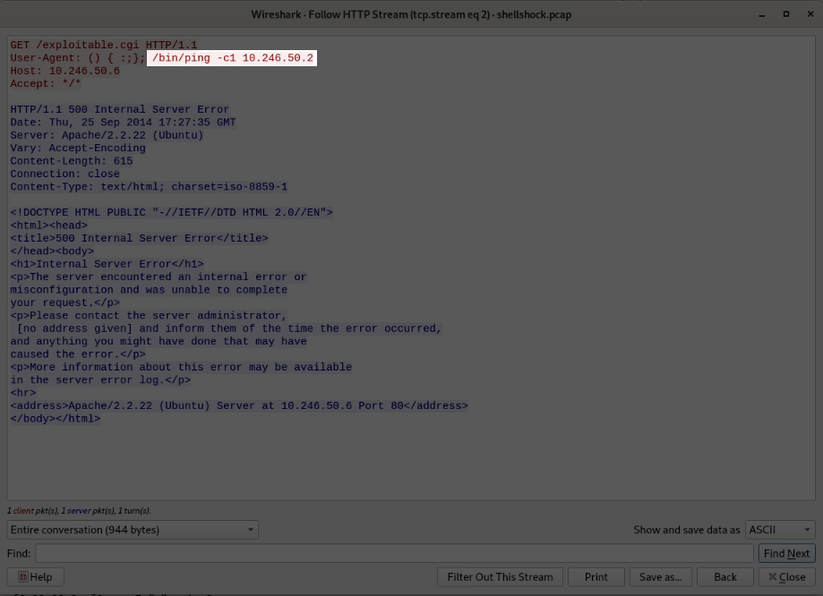

# **Challenge**

**Author**: Hakal  
**Title**: Shellshock Attack  
**Level**: Easy

---

## Introduction

Can you determine evidence of port scan activity?

Log file: `/root/Desktop/ChallengeFile/shellshock.pcap`

Note: The `.pcap` file was found in public resources.

---

### Analysis Steps

After following the lab instructions, we need to connect to the machine and analyze the `.pcap` files using the provided tool. The idea is to make the process easier.

---

### Question 1: What is the server operating system?

Before starting to analyze the communications, we need to understand what a [`Shellshock`](https://en.wikipedia.org/wiki/Shellshock_(software_bug)) attack is. In summary, Shellshock, also known as Bashdoor, was a critical vulnerability in the Bash command interpreter (widely used in Unix-like systems such as Linux and macOS) revealed in September 2014. It allowed attackers to execute arbitrary commands on vulnerable systems, compromising web servers, IoT devices, and other internet-connected equipment.

Now that we know we are dealing with an application layer attack, specifically `HTTP/WEB`, we can filter the HTTP packets to analyze the responses and observe how we can determine the operating system running on the server.

To capture this specific packet, use the filter `http` on the filter bar at the top of the window. With the filter applied, we will see only two packets that likely answer our question. Now, with the packets, we can perform a `Follow HTTP Stream` to analyze the headers of the HTTP requests more simply and easily.

To do this, right-click on one of the packets and select the mentioned option.



In the HTTP Stream, we can see the response header indicating the server, version, and operating system, consequently answering our question.



So, we can conclude that the operating system running on the server is Ubuntu, as indicated by the response headers in the HTTP stream analysis.

---

### Question 2: What is the application server and version running on the target system?

Using the same approach as before, we can access the version of the application being executed.



This happens because many servers (like Apache, Nginx, or IIS) automatically include headers like `Server` or `X-Powered-By` in HTTP responses. These headers reveal details about the underlying infrastructure, which is considered a security bad practice as it exposes information that can lead to targeted attacks on specific software vulnerabilities. Therefore, avoid doing this.

---

### Question 3: What is the exact command that the attacker wants to run on the target server?

Still in the same `HTTP Stream`, the exploitation of the Shellshock vulnerability on the web server is clearly visible. In the HTTP User-Agent header, the attacker injected malicious code:

```bash
() { :;}; /bin/ping -c1 10.246.50.2
```

**Explanation of the Command:**

- `() { :;};`: is an empty Bash function that exploits the Shellshock vulnerability.
- `/bin/ping -c1 10.246.50.2`: is the command executed by the server if Bash is vulnerable, demonstrating a [`Remote Code Execution`](https://en.wikipedia.org/wiki/Arbitrary_code_execution) as described by the vulnerability earlier.



In summary, this occurs because web servers configured with CGI ([`Common Gateway Interface`](https://en.wikipedia.org/wiki/Common_Gateway_Interface)) expose environment variables (such as `User-Agent`) to Bash, causing the server to process `User-Agent` as a Bash function and execute the subsequent command, even if the function is empty.

This allows full control over the server and clearly shows how vulnerabilities in fundamental components (like Bash) can have severe consequences on systems exposed to the internet.

---

## Conclusion

By analyzing the `.pcap` file, we have successfully identified evidence of a Shellshock attack. This analysis has provided valuable insights into the nature of the attack, the server's operating system, the application server and its version, and the exact command the attacker attempted to execute. Understanding these elements is crucial for recognizing and mitigating similar vulnerabilities in the future.

### Key Takeaways

- Shellshock, also known as Bashdoor, is a critical vulnerability in the Bash command interpreter that allows attackers to execute arbitrary commands on vulnerable systems. This vulnerability can compromise web servers, IoT devices, and other internet-connected equipment.
- The ability to analyze **`.pcap`** files is essential for identifying signs of exploitation. By filtering HTTP packets and following HTTP streams, we can extract valuable information about the attack and the target system.
- It is important to secure web servers by avoiding the exposure of sensitive information through HTTP headers. Headers like **`Server`** and **`X-Powered-By`** can reveal details about the underlying infrastructure, making it easier for attackers to target specific software vulnerabilities.
- Understanding how remote code execution vulnerabilities, such as Shellshock, can be exploited helps in implementing effective security measures. Ensuring that web servers are not configured with CGI scripts that expose environment variables to Bash is one such measure.

By following these key takeaways, we can enhance our security posture and better protect systems from similar attacks in the future.

---
